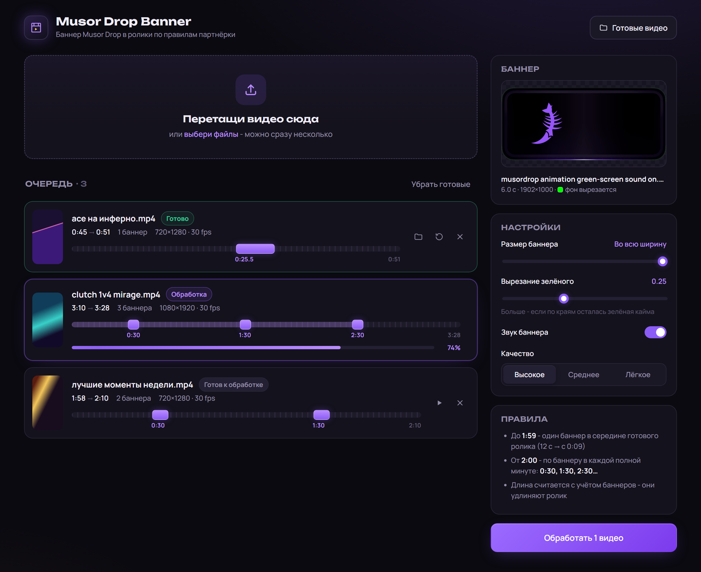

<div align="center">

# Musor Drop Banner

**Вставляет баннер Musor Drop в твои ролики по правилам партнёрки.**<br>
Кидаешь пачку видео - забираешь готовые.


[](https://t.me/attavian0)

<br>



</div>

<br>

## Что умеет

- Сам считает, куда ставить баннер, по правилам партнёрки
- Замораживает кадр, пока играет баннер, потом видео идёт дальше
- Вырезает зелёный фон баннера, звук баннера сохраняется
- Обрабатывает сразу пачку роликов: прогресс, предпросмотр, папка с готовыми
- Отдельно ставить ничего не нужно, ffmpeg приезжает вместе с зависимостями

## Как ставятся баннеры

| Длина ролика | Баннеры |
|:---|:---|
| до 1:59 | один, начинается в середине готового видео |
| 2:00 - 2:59 | два: на 0:30 и 1:30 |
| 3:00 - 3:59 | три: на 0:30, 1:30 и 2:30 |
| и дальше | +1 баннер на каждую полную минуту |

Длина считается вместе с баннерами, потому что каждый баннер удлиняет ролик на 6 секунд:

- ролик на 12 секунд превращается в 18, баннер идёт с 0:09 до 0:15
- ролик на 1:58 с двумя баннерами выходит на 2:10, поэтому баннеров два, а не один

## Быстрый старт

1. Поставь [Python 3.10 или новее](https://www.python.org/downloads/). При установке отметь **Add python.exe to PATH**.
2. Скачай репозиторий: зелёная кнопка **Code** → **Download ZIP**, распакуй.
3. Скачай анимацию баннера в кабинете партнёрки Musor Drop и положи в папку с программой. В названии файла должно быть `green-screen` или `musordrop`, например `musordrop animation green-screen sound on.mp4`.
4. Запусти **`start.bat`**. В первый раз он сам поставит зависимости, потом откроет программу в браузере.

Дальше перетаскиваешь видео в окно, жмёшь **«Обработать»** и забираешь готовые ролики из папки `output`.

> Окно консоли, которое открывает `start.bat`, не закрывай, пока работаешь: это и есть программа.

На macOS и Linux вместо `start.bat`:

```bash
pip install -r requirements.txt
python app.py
```

## Без интерфейса

Перетащи ролики на **`drop_video_here.bat`**. Готовые файлы появятся рядом с исходниками, с приставкой `_musordrop`.

Или из консоли:

```bash
python musordrop.py clip1.mp4 clip2.mp4     # несколько сразу
python musordrop.py clip.mp4 --dry-run      # только показать тайминги
python musordrop.py clip.mp4 --scale 0.8    # баннер на 80% ширины
python musordrop.py clip.mp4 --mute         # без звука баннера
```

Все опции: `python musordrop.py -h`.

## Частые вопросы

<details>
<summary><b>По краям баннера осталась зелёная кайма</b></summary>
<br>
Подвинь вправо ползунок «Вырезание зелёного» в настройках. В консоли: <code>--similarity 0.3</code>.
</details>

<details>
<summary><b>Пишет, что баннер не найден</b></summary>
<br>
Файл баннера должен лежать в той же папке, что и <code>start.bat</code>, и в его названии должно быть <code>green-screen</code> или <code>musordrop</code>. После того как положил файл, обнови страницу.
</details>

<details>
<summary><b>Пишет, что видео слишком короткое</b></summary>
<br>
Баннер ставится в середину ролика, поэтому видео должно быть хоть немного длиннее самого баннера.
</details>

<details>
<summary><b>Где готовые видео?</b></summary>
<br>
В папке <code>output</code> рядом с программой. Её же открывает кнопка «Готовые видео».
</details>

<details>
<summary><b>Почему баннера нет в репозитории?</b></summary>
<br>
Это файл Musor Drop, его выдают партнёрам в кабинете. Здесь только программа.
</details>

<br>

<div align="center">

Сделано для партнёров Musor Drop. Новости и обновления в Telegram:

[](https://t.me/attavian0)

</div>
